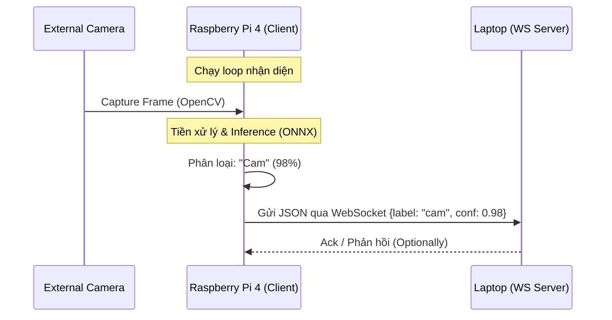

# Kế hoạch Tích hợp Hệ thống (Pi - Camera - Laptop)

Tài liệu này mô tả chi tiết cách kết nối các thành phần phần cứng và phần mềm để tạo ra một hệ thống nhận diện trái cây thời gian thực hoàn chỉnh.

## 📐 Kiến trúc Tổng quát

Hệ thống hoạt động theo mô hình **Edge-Inference + Remote-Monitoring**:

1. **Raspberry Pi (Edge Device)**: Đóng vai trò là thiết bị ngoại vi, thực hiện chụp ảnh và phân loại tại chỗ.
2. **Laptop (Monitoring/Server)**: Đóng vai trò là trung tâm điều khiển, nhận kết quả và hiển thị cho người dùng.

### Sơ đồ luồng dữ liệu (Data Flow)

## 🔌 Cấu hình Phần cứng (Hardware)

* **Camera**: Khuyên dùng **USB Webcam** (Cắm và chạy) hoặc **Pi Camera Module** (CSI port).
* **Kết nối**: Pi 4 và Laptop nên ở trong cùng một mạng LAN/Wifi để đảm bảo độ trễ thấp nhất.

## 🛠️ Thành phần Phần mềm (Software Components)

### 1. Tại Raspberry Pi (Inference Loop)

Dựa trên script `pi_inference.py`, chúng ta sẽ tạo thêm một module `cam_stream.py`:

* **OpenCV**: Sử dụng `cv2.VideoCapture(0)` để lấy luồng video.

* **Websockets Client**: Sử dụng thư viện `websockets` (asyncio) để duy trì kết nối với Laptop.

### 2. Tại Laptop (WebSocket Server)

Laptop chạy một script Python (`server.py`) để lắng nghe kết quả:

* Nhận dữ liệu JSON.

* Xử lý logic tiếp theo (Lưu log, hiển thị thông báo, hoặc điều khiển thiết bị khác).

## 🚀 Quy trình Triển khai

1. **Bước 1**: Khởi chạy WebSocket Server trên Laptop (IP cố định hoặc `.local`).
2. **Bước 2**: Khởi chạy script Camera Stream trên Pi.
3. **Bước 3**: Pi tự động chụp ảnh -> Phân loại -> Gửi kết quả về Laptop theo chu kỳ hoặc khi phát hiện có trái cây.

## 📌 Lưu ý về Hiệu suất

* **Tốc độ khung hình (FPS)**: Trên Pi 4 với ONNX Runtime, tốc độ classification có thể đạt 5-10 FPS tùy thuộc vào độ phức tạp của mô hình.

* **Độ trễ (Latency)**: Giao tiếp WebSocket qua Wifi nội bộ có độ trễ cực thấp (< 20ms).
