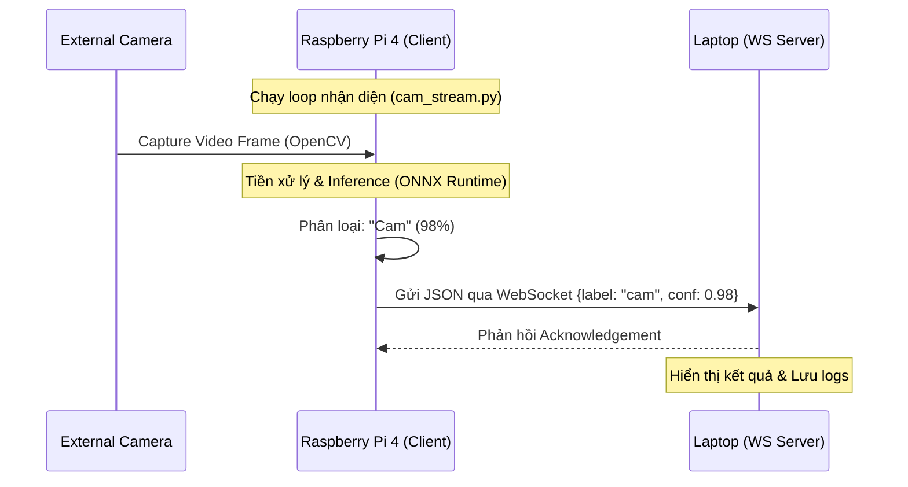

# Kế hoạch Tích hợp Hệ thống (Pi - Camera - Laptop)

Tài liệu này mô tả chi tiết cách kết nối các thành phần phần cứng và phần mềm để tạo ra một hệ thống nhận diện trái cây thời gian thực hoàn chỉnh.

## 📐 Kiến trúc Tổng quát

Hệ thống hoạt động theo mô hình **Edge-Inference + Remote-Monitoring**:

1. **Raspberry Pi (Edge Device)**: Đóng vai trò là thiết bị ngoại vi, thực hiện chụp ảnh và phân loại tại chỗ.
2. **Laptop (Monitoring/Server)**: Đóng vai trò là trung tâm điều khiển, nhận kết quả và hiển thị cho người dùng.

### Sơ đồ luồng dữ liệu (Data Flow)

## 🔌 Cấu hình Phần cứng (Hardware)

* **Camera**: Khuyên dùng **USB Webcam** (Cắm và chạy) cho độ ổn định cao hoặc **Pi Camera Module 3**.
* **Kết nối**: Pi 4 và Laptop cần ở trong cùng một mạng LAN/Wifi. Sử dụng IP tĩnh hoặc mDNS (`.local`) để kết nối ổn định.

## 🛠️ Thành phần Phần mềm (Software Components)

### 1. Tại Raspberry Pi (Inference Loop)

Sử dụng script `cam_stream.py` để kết nối các module:

* **OpenCV**: Capture frame từ `/dev/video0`.
* **FruitClassifier**: Module xử lý AI dựa trên ONNX Runtime.
* **Websockets Client**: Duy trì kết nối non-blocking tới laptop.

### 2. Tại Laptop (WebSocket Server)

Chạy `server.py` để làm trung tâm tiếp nhận:

* **Async Server**: Xử lý đồng thời nhiều kết nối nếu cần.
* **Data Processing**: Phân tích log, cảnh báo nếu độ tin cậy thấp.

## 🚀 Quy trình Triển khai

1. **Bước 1**: Khởi chạy WebSocket Server trên Laptop: `python server.py`.
2. **Bước 2**: Khởi chạy script Camera Stream trên Pi: `python cam_stream.py`.
3. **Bước 3**: Giám sát kết quả hiển thị trên terminal của Laptop.

## 📌 Thông số Hiệu suất (Target)

* **FPS**: 5-10 frame mỗi giây.
* **Latency**: < 200ms từ lúc chụp ảnh đến lúc hiển thị kết quả trên server.
* **Cân bằng tải**: Tối ưu CPU Pi với `asyncio.sleep` phù hợp (0.1 - 0.2s).
